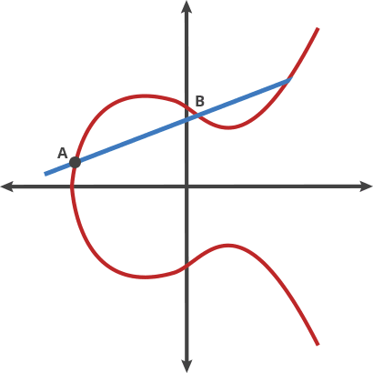

HTTP协议和HTTPS协议区别如下： 

1）HTTPS为了解决HTTP明文传输的安全性问题提出的。相比http多了一个SSL层。

2）HTTPS在TCP三次握手阶段之后，还需要进行SSL 的handshake，协商加密使用的对称加密密钥 。

3）HTTPS协议需要服务端申请证书，浏览器端安装对应的根证书 

4）HTTP协议端口是80，HTTPS协议端口是443

HTTPS缺点： 1）HTTPS握手阶段延时较高：由于在进行HTTP会话之前还需要进行SSL握手，因此HTTPS协议握手阶段延时增加 2）HTTPS部署成本高：一方面HTTPS协议需要使用证书来验证自身的安全性，所以需要购买CA证书；另一方面由于采用HTTPS协议需要进行加解密的计算，占用CPU资源较多，需要的服务器配置或数目高。但是为了安全，肯定要在性能上有所牺牲。这个是没办法避免的。

SSL(Secure Socket Layer 安全套接层)

是基于HTTP之下TCP之上的一个协议层，是基于HTTP标准并对TCP传输数据时进行加密，所以HPPTS是HTTP+SSL/TCP的简称。

（1） 窃听风险（eavesdropping）：第三方可以获知通信内容。（2） 篡改风险（tampering）：第三方可以修改通信内容。（3） 冒充风险（pretending）：第三方可以冒充他人身份参与通信。 

（1） 所有信息都是加密传播，第三方无法窃听。（2） 具有校验机制，一旦被篡改，通信双方会立刻发现。（3） 配备身份证书，防止身份被冒充。 

SSl协议的内容就是在TCP上多了一个握手：（1） 客户端向服务器端索要并验证公钥。（2） 双方协商生成"对话密钥"。（3） 双方采用"对话密钥"进行加密通信。 

SSL/TLS协议的基本思路是采用[公钥加密法](http://en.wikipedia.org/wiki/Public-key_cryptography)，也就是说，客户端先向服务器端索要公钥，然后用公钥加密信息，服务器收到密文后，用自己的私钥解密。

保证公钥不被篡改：将公钥放在数字证书中，只要证书是可信的，公钥就是可信的。

公钥加密计算量太大，如何减少耗用的时间？解决方法：每一次对话（session），客户端和服务器端都生成一个"对话密钥"（session key），用它来加密信息。由于"对话密钥"是对称加密，所以运算速度非常快，而服务器公钥只用于加密"对话密钥"本身，这样就减少了加密运算的消耗时间。
=============================================================================================================================================

为了确保公开的公钥是真实的：数字证书是数字证书在一个身份和该身份的持有者所拥有的公/私钥对之间建立了一种联系，由认证中心（CA）或者认证中心的下级认证中心颁发的。根证书是认证中心与用户建立信任关系的基础。在用户使用数字证书之前必须首先下载和安装。 

---

非对称密码学的基本原理：一个正方向计算很容易，反方向倒推很难的算法。
==================================

 一般都是基于离散对数问题。即已知g^a求a是比较难的，这里a就是私钥，g^a就是公钥

椭圆曲线
====

===========================================================

一条椭圆曲线是一组满足一个特定方程的点的集合。椭圆曲线的方程类似这样： 

y2 = ax^3 + bx^2 + cx+d

椭圆曲线还有其他的表现形式，但准确来说椭圆曲线是一个二元方程，其中一个二阶变量，一个三阶变量。

其中一个特性是水平对称：曲线上的任何点以X轴作映射后得到的仍然是同一曲线。

一个更加有趣的特性是：任何不垂直的直线穿过曲线最多有三个交点。

我们把球沿两点的移动叫作“打点（dot）”。曲线上的任意两点A，B 被打点后都能得到一个新点C。

根据两个打点AB，得到一个新的点C，再根据CA可以得到新的打点。/\>

事实证明如果你有两个点，一个是起点，一个是打点n次后得到的终点，在你只知道起点和终点，想找出n的值是很困难的。
=======================================================

加密的过程：选取一个比较大的质数，当打点的函数值大于该数后就要把它进行截取返回处理。（通常返回的结果是事先选好的一个比较合理的数）
=================================================================

椭圆曲线加密算法原理如下： 

设私钥n、公钥K，即K = nG，其中G为基点。 

公钥加密：将明文编码到椭圆曲线上一点M。再选择随机数r。计算点C1=M+rK和C2=rG

私钥解密：C1−kC2，结果就是点M，因为C1−kC2=M+rK−k(rG)=M+rkG−krG=M

---

RSA算法及其数学原理：两个质数相乘的结果n很容易，但是对n因式分解为两个质数相乘却很难。
=============================================

 欧拉函数：φ(1)=1性质：如果数是质数，φ(x)=(x-1)

1 密钥和公钥生成过程

* 随机找出两个不同的质数（越大越好）p，q。
* n=p\*q,根据欧拉函数，有 

r: rgb(27, 27, 27); font-family: -apple-system-font; font-variant-caps: normal;"\>随机找出一个数e，使

* -system-font; font-variant-caps: normal;"\>计算e对于
* 2 加密和解密过程

  假设待加密资料为m（必须小于n，如果大于，采用分段加密方式解决）。 

  根据同余定理，对加密资料m，利用公钥e和n进行加密。

  加密资料: 

  解密密文： 

同余定理：如果两个整数a和b，(a-b)能被m整除，则a和b被m除的余数相同，记做
=========================================

  如果有，则

\<, 27, 27); letter-spacing: normal; text-align: start; text-indent: 0px; text-transform: none; white-space: normal; word-spacing: 0px; -webkit-text-stroke-width: 0px;"\>3 数学基础 

  具体参考：<https://blog.csdn.net/idwtwt/article/details/81125045> 

3.1 同余定理 
---------

  如果两个整数a和b，(a-b)能被m整除，则a和b被m除的余数相同，记做

  如果有 

  同余定理性质： 

  1. 性质2：若a≡b（mod m），那么b≡a（mod m），（对称性）。
  2. 性质3：若a≡b（mod m），b≡c（mod m），那么a≡c（mod m），（传递性）。
  3. 性质4：若a≡b（mod m），c≡d（mod m），那么a±c≡b±d（mod m），（可加减性）。
  4. 性质5：若a≡b（mod m），c≡d（mod m），那么ac≡bd（mod m）（可乘性）。
  5. 性质6：若a≡b（mod m），那么an≡bn（mod m），（其中n为自然数）。
  6. 性质7：若ac≡bc（mod m），（c，m）=1，那么a≡b（mod m），（记号（c，m）表示c与m的最大公约数）。
  7. 性质8：若a≡b（mod m），那么a的n次方和b的n次方也对于m同余。
  8. 性质9：若a≡b（mod m）、c≡d（mod m）、e≡f（mod m）……x≡y（mod m）

3.2 幂同余定理(同余定理可乘性)
------------------

  根据：

  同余定理可乘性：

  若a≡b（mod m），c≡d（mod m），那么ac≡bd（mod m）

  另c=a,d=b,则 

3.3 费马小定理 
----------

  假如p是[质数](https://baike.baidu.com/item/%E8%B4%A8%E6%95%B0/263515)，且gcd(a,p)=1，即a,p互质，那么  

3.4 欧拉定理和欧拉函数 
--------------

  如果两个正整数a和n互质，则： 

  其中φ(n)称为n的欧拉函数，代表小于等于n的正整数之中，有多少个与n构成互质关系。 

  φ(n) 的计算方法分为四种情况： 

  * 第一种情况

  如果n=1，则 φ(1) = 1 。因为1与任何数（包括自身）都构成互质关系。 

  * 第二种情况

  如果n是质数，则 φ(n)=n-1 。因为质数与小于它的每一个数，都构成互质关系。比如5与1、2、3、4都构成互质关系。 

  当n为质数时，则欧拉定理退化为费马小定理，即费马小定理是欧拉定理的特殊情况。 

  * 第三种情况

  如果n是质数的某一个次方，即 n = p^k (p为质数，k为大于等于1的整数)，则 

  比如 φ(8) = φ(2^3) =2^3 - 2^2 = 8 -4 = 4。 

  这是因为只有当一个数不包含质数p，才可能与n互质。而包含质数p的数一共有p^(k-1)个，即1×p、2×p、3×p、...、p^(k-1)×p，把它们去除，剩下的就是与n互质的数。 

  上面的式子还可以写成下面的形式：
* 第四种情况

如果n可以分解成两个互质的整数之积， 

n = p1 × p2

则 

φ(n) = φ(p1p2) = φ(p1)φ(p2)

即积的欧拉函数等于各个因子的欧拉函数之积。比如，φ(56)=φ(8×7)=φ(8)×φ(7)=4×6=24。 

4 加密原理数学证明 
===========

证明加密的数学原理正确，需要证明： 

当密文采用计算方法：，则资料可以通过密文和密钥解出： 

其中n=p\*q，p,q为不相同的两个随机质数，m为需要加密的资料，m满足m\<n 

由，根据同余定理知 

代入spacing: normal; text-indent: 0px; text-transform: none; white-space: normal; word-spacing: 0px; -webkit-text-stroke-width: 0px; font-size: 18px; color: rgb(27, 27, 27); font-family: -apple-system-font; font-variant-caps: normal;-en-paragraph:true;"\>得 

根据同余定理： 

因为kn带有n因子，所以只能 

整除n 

因为(d为e对于模反元素) 

所以需要证明： 

lor: rgb(27, 27, 27); letter-spacing: normal; text-align: start; text-indent: 0px; text-transform: none; white-space: normal; word-spacing: 0px; -webkit-text-stroke-width: 0px;"\>a 如果m与n互质，根据欧拉定理： 

又幂同余定理得和同余定理乘法定理得： 

即 

得证。 

因为m\<n,m和n不是互质关系，又n=pq，p,q都为质数， 
--------------------------------

所以m必然包含p或q因子，即 

m=kp或m=kq

假定m=kp，m必然与q互质（不可能同时包含因子p和因子q，否则必然不可能小于n=pq；而一个[质数](https://baike.baidu.com/item/%E8%B4%A8%E6%95%B0)，另一个不为它的倍数，这两个数为互质数） 

由欧拉定理得： 

根据幂同余定理： 

即： 

根据模反元素的定义 

所以： 

根据同余定理： 

 letter-spacing: normal; text-align: start; text-indent: 0px; text-transform: none; white-space: normal; word-spacing: 0px; -webkit-text-stroke-width: 0px; margin-top: 1em; margin-bottom: 1em;"\>两边同时除于m 

左边为整数，m和q互质，则t必然包含因子m，即 

所以 

所以 

system-font; font-variant-caps: normal;"\>得证